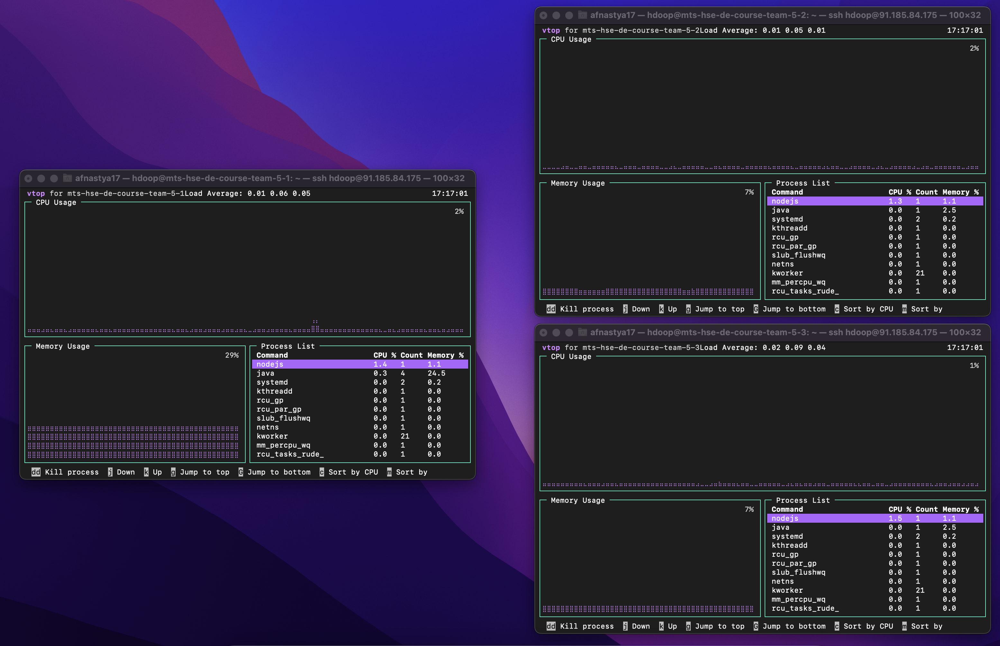
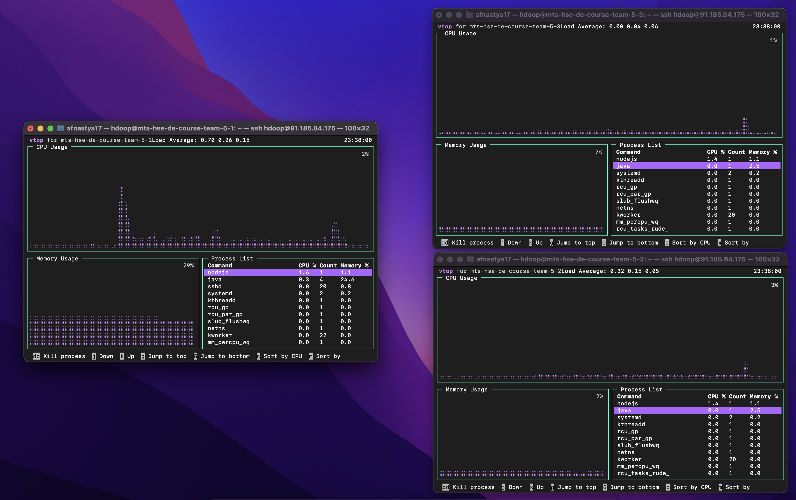
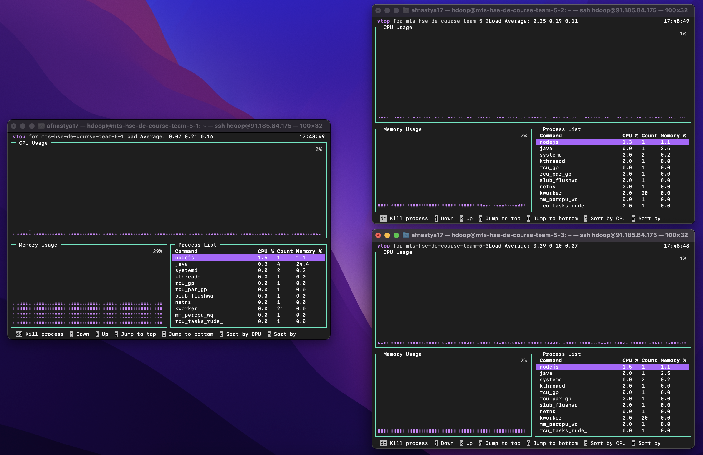
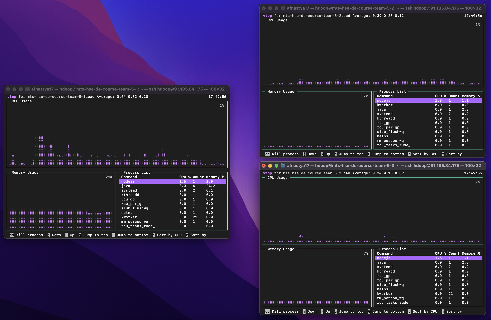

# Задание 2. Ресурсы, журнал изменений


## 1 большой файл

```
    openssl rand 1100000000 >bigfile.txt    # создаем файл ~1.1Gb с рандомными байтами

    ls -lah
    ------------------------------------------------------------------
    -rw-rw-r--  1 hdoop hdoop 1.1G Oct 20 12:05  bigfile.txt
```

#### До загрузки

```
    df -h /         # информация о заполнении диска

    -------------------------------------------------------------------
    Filesystem      Size  Used Avail Use% Mounted on          # main
    /dev/sda2       295G   13G  270G   5% /

    Filesystem      Size  Used Avail Use% Mounted on          # slave1
    /dev/sda2       295G   11G  272G   4% /

    Filesystem      Size  Used Avail Use% Mounted on          # slave2
    /dev/sda2       295G   11G  272G   4% /
```

Смотрим какие сейчас последние записи в журнале изменений и образ файловой системы:
```
    ls -lah ./tmpdata/dfs/name/current/ | tail

    -----------------------------------------------------------------------------------------
    -rw-rw-r-- 1 hdoop hdoop   42 Nov  8 17:12 edits_0000000000000081181-0000000000000081182
    -rw-rw-r-- 1 hdoop hdoop 1.7K Nov  8 17:13 edits_0000000000000081183-0000000000000081214
    -rw-rw-r-- 1 hdoop hdoop  100 Nov  8 17:14 edits_0000000000000081215-0000000000000081217
    -rw-rw-r-- 1 hdoop hdoop   42 Nov  8 17:15 edits_0000000000000081218-0000000000000081219
    -rw-rw-r-- 1 hdoop hdoop  118 Nov  8 17:16 edits_0000000000000081220-0000000000000081222
    -rw-rw-r-- 1 hdoop hdoop 1.0M Nov  8 17:16 edits_inprogress_0000000000000081223
    -rw-rw-r-- 1 hdoop hdoop  397 Oct 11 17:58 fsimage_0000000000000000000
    -rw-rw-r-- 1 hdoop hdoop   62 Oct 11 17:58 fsimage_0000000000000000000.md5
    -rw-rw-r-- 1 hdoop hdoop    6 Nov  8 17:16 seen_txid
    -rw-rw-r-- 1 hdoop hdoop  213 Oct 11 17:58 VERSION
```

Смотрим текущее потребление CRU и RAM командой vtop.


#### Загружаем файл в hdfs

```
    hdfs dfs -mkdir /bigfiles
    hdfs dfs -put ./bigfile.txt /bigfiles/bigfile.txt 
```


#### После загрузки

Смотрим потребление CRU и RAM во время исполнения нашей загрузки командой vtop.


Видим, что на datanode'ах увеличилось использование диска примерно на гигабайт.
```
    df -h /     # информация о заполнении диска

    --------------------------------------------------------------------
    Filesystem      Size  Used Avail Use% Mounted on            # main
    /dev/sda2       295G   13G  270G   5% /

    Filesystem      Size  Used Avail Use% Mounted on            # slave1
    /dev/sda2       295G   12G  271G   5% /

    Filesystem      Size  Used Avail Use% Mounted on            # slave2
    /dev/sda2       295G   12G  271G   5% /
```

Видим, что добавились новые файлы edits.
```
    ls -lah ./tmpdata/dfs/name/current/ | tail

    -----------------------------------------------------------------------------------------
    -rw-rw-r-- 1 hdoop hdoop 1.7K Nov  8 17:13 edits_0000000000000081183-0000000000000081214
    -rw-rw-r-- 1 hdoop hdoop  100 Nov  8 17:14 edits_0000000000000081215-0000000000000081217
    -rw-rw-r-- 1 hdoop hdoop   42 Nov  8 17:15 edits_0000000000000081218-0000000000000081219
    -rw-rw-r-- 1 hdoop hdoop  118 Nov  8 17:16 edits_0000000000000081220-0000000000000081222
    -rw-rw-r-- 1 hdoop hdoop 1.9K Nov  8 17:17 edits_0000000000000081223-0000000000000081254
    -rw-rw-r-- 1 hdoop hdoop 1.0M Nov  8 17:17 edits_inprogress_0000000000000081255
    -rw-rw-r-- 1 hdoop hdoop  397 Oct 11 17:58 fsimage_0000000000000000000
    -rw-rw-r-- 1 hdoop hdoop   62 Oct 11 17:58 fsimage_0000000000000000000.md5
    -rw-rw-r-- 1 hdoop hdoop    6 Nov  8 17:17 seen_txid
    -rw-rw-r-- 1 hdoop hdoop  213 Oct 11 17:58 VERSION
```

Смотрим логи нашей операции в журнале изменений с помощью следующей команды, её вывод [здесь](edits_log_one.xml).
```
    hdfs oev -p xml -i ./tmpdata/dfs/name/current/edits_0000000000000081223-0000000000000081254 -o edits_log.xml && cat edits_log.xml
```

## Много файлов

Генерируем много файлов с помощью следующего скрипта:
```
    for i in $(seq 1 1000);
    do
        openssl rand 1100000 >many_files/file_$i.txt
    done
```

#### До загрузки

```
    df -h /         # информация о заполнении диска

    --------------------------------------------------------------------
    Filesystem      Size  Used Avail Use% Mounted on            # main
    /dev/sda2       295G   14G  269G   5% /

    Filesystem      Size  Used Avail Use% Mounted on            # slave1
    /dev/sda2       295G   12G  271G   5% /

    Filesystem      Size  Used Avail Use% Mounted on            # slave2
    /dev/sda2       295G   12G  271G   5% /
```

Смотрим какие сейчас последние записи в журнале изменений и образ файловой системы:
```
    ls -lah ./tmpdata/dfs/name/current/ | tail

    -----------------------------------------------------------------------------------------
    -rw-rw-r-- 1 hdoop hdoop   42 Nov  8 17:44 edits_0000000000000081307-0000000000000081308
    -rw-rw-r-- 1 hdoop hdoop   42 Nov  8 17:45 edits_0000000000000081309-0000000000000081310
    -rw-rw-r-- 1 hdoop hdoop   42 Nov  8 17:46 edits_0000000000000081311-0000000000000081312
    -rw-rw-r-- 1 hdoop hdoop   42 Nov  8 17:47 edits_0000000000000081313-0000000000000081314
    -rw-rw-r-- 1 hdoop hdoop   42 Nov  8 17:48 edits_0000000000000081315-0000000000000081316
    -rw-rw-r-- 1 hdoop hdoop 1.0M Nov  8 17:48 edits_inprogress_0000000000000081317
    -rw-rw-r-- 1 hdoop hdoop  397 Oct 11 17:58 fsimage_0000000000000000000
    -rw-rw-r-- 1 hdoop hdoop   62 Oct 11 17:58 fsimage_0000000000000000000.md5
    -rw-rw-r-- 1 hdoop hdoop    6 Nov  8 17:48 seen_txid
    -rw-rw-r-- 1 hdoop hdoop  213 Oct 11 17:58 VERSION
```

Смотрим текущее потребление CRU и RAM командой vtop.


#### Загружаем файл в hdfs

```
    hdfs dfs -put ./many_files /bigfiles/many_files
```


#### После загрузки

Смотрим потребление CRU и RAM во время исполнения нашей загрузки командой vtop.


Видим, что на datanode'ах увеличилось использование диска примерно на гигабайт.
```
    df -h /     # информация о заполнении диска

    --------------------------------------------------------------------
    Filesystem      Size  Used Avail Use% Mounted on            # main
    /dev/sda2       295G   14G  269G   5% /

    Filesystem      Size  Used Avail Use% Mounted on            # slave1
    /dev/sda2       295G   13G  270G   5% /

    Filesystem      Size  Used Avail Use% Mounted on            # slave2
    /dev/sda2       295G   13G  270G   5% /
```

Видим, что добавились новые файлы edits, один из которых весит 585K, там-то и лежат логи нашей операции
```
    ls -lah ./tmpdata/dfs/name/current/ | tail

    -----------------------------------------------------------------------------------------
    -rw-rw-r-- 1 hdoop hdoop   42 Nov  8 17:45 edits_0000000000000081309-0000000000000081310
    -rw-rw-r-- 1 hdoop hdoop   42 Nov  8 17:46 edits_0000000000000081311-0000000000000081312
    -rw-rw-r-- 1 hdoop hdoop   42 Nov  8 17:47 edits_0000000000000081313-0000000000000081314
    -rw-rw-r-- 1 hdoop hdoop   42 Nov  8 17:48 edits_0000000000000081315-0000000000000081316
    -rw-rw-r-- 1 hdoop hdoop 585K Nov  8 17:49 edits_0000000000000081317-0000000000000087319
    -rw-rw-r-- 1 hdoop hdoop 1.0M Nov  8 17:49 edits_inprogress_0000000000000087320
    -rw-rw-r-- 1 hdoop hdoop  397 Oct 11 17:58 fsimage_0000000000000000000
    -rw-rw-r-- 1 hdoop hdoop   62 Oct 11 17:58 fsimage_0000000000000000000.md5
    -rw-rw-r-- 1 hdoop hdoop    6 Nov  8 17:49 seen_txid
    -rw-rw-r-- 1 hdoop hdoop  213 Oct 11 17:58 VERSION
```

Посмотреть эти логи нашей операции в журнале изменений можно с помощью следующей команды:
```
    hdfs oev -p xml -i ./tmpdata/dfs/name/current/edits_0000000000000081317-0000000000000087319 -o edits_log.xml
```